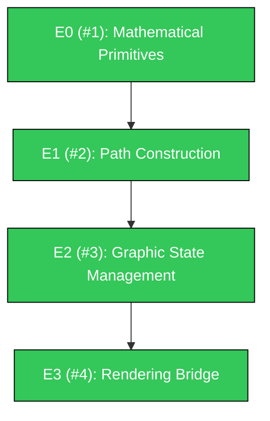

# PureDraw

PureDraw is a dependency-free, Swift-native 2D graphics engine.

It provides a "Virtual PostScript Machine" API compatible with CoreGraphics (Quartz) and the HTML5 Canvas. The package is intentionally strict about portability:

- no external SwiftPM dependencies
- no bundled C sources
- no Foundation requirement in the library target
- macOS, Linux, Windows, and WASI build gates

It is a sibling project to [PureXML](https://github.com/mihaelamj/PureXML) and [PureYAML](https://github.com/mihaelamj/PureYAML).

## Roadmap

## Philosophy
PureDraw implements the mathematical foundation of 2D rendering:
1. **Affine Transforms:** Full 3x3 Matrix math for coordinate space mapping.
2. **Path Construction:** Resolution-independent Bézier curves and geometry.
3. **Painter's Algorithm:** A state-based command buffer that separates drawing intent from the final pixel rasterization.

## License
MIT.

## Community & Documentation

- [CONTRIBUTING.md](CONTRIBUTING.md): Guidelines for submitting PRs and feature requests.
- [SECURITY.md](SECURITY.md): Vulnerability reporting instructions.
- [SUPPORT.md](SUPPORT.md): How to get help.
- [CODE_OF_CONDUCT.md](CODE_OF_CONDUCT.md): Community standards.
- [AGENTS.md](AGENTS.md): AI Agent instructions for working within this repository.
