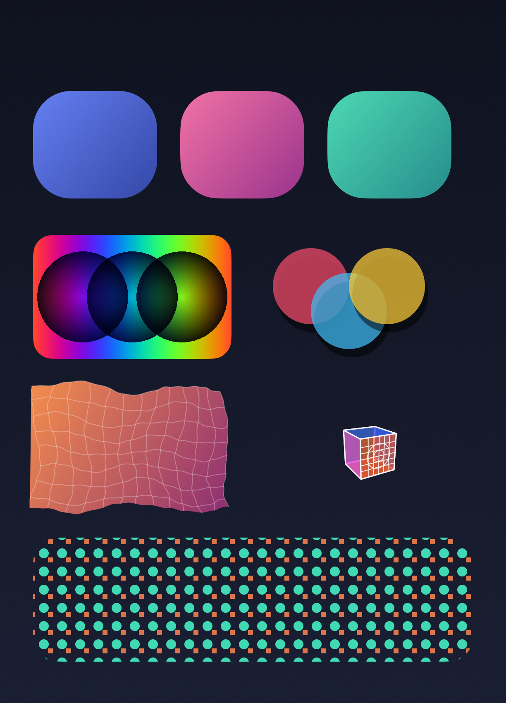
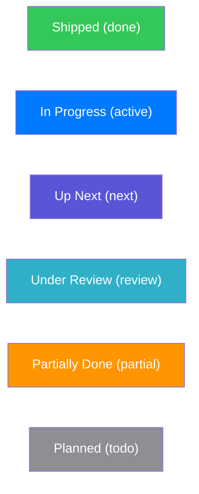
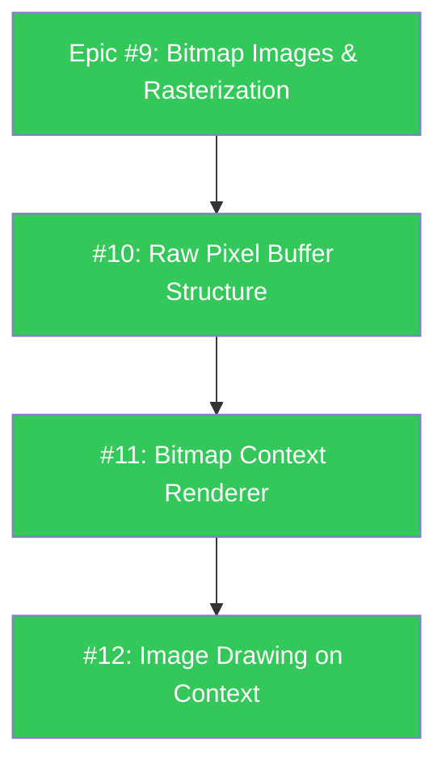
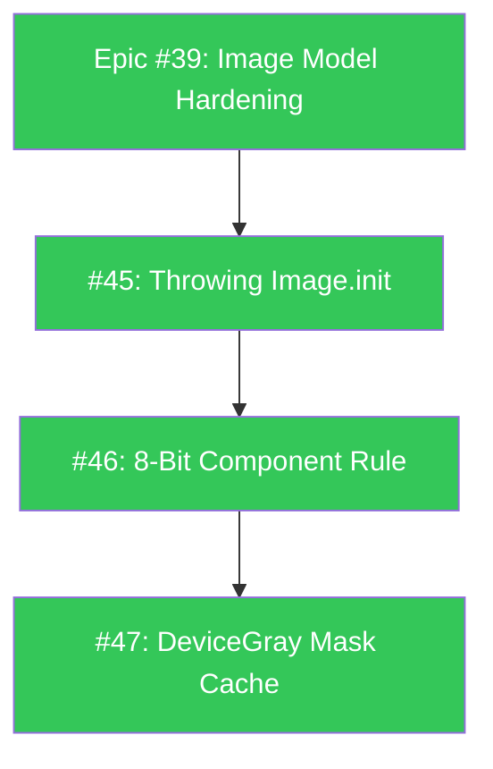
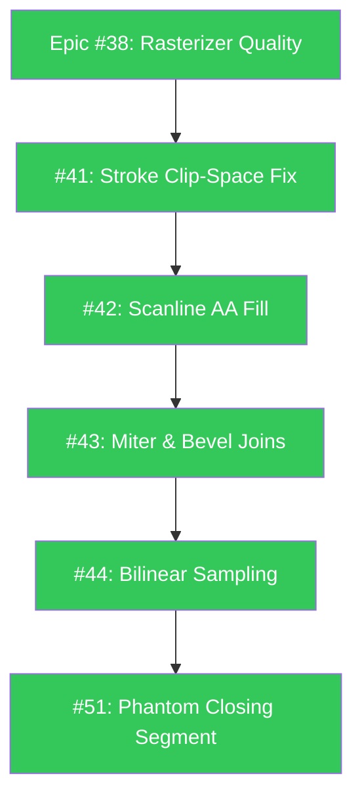
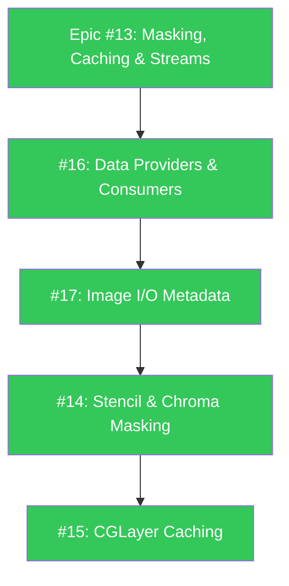
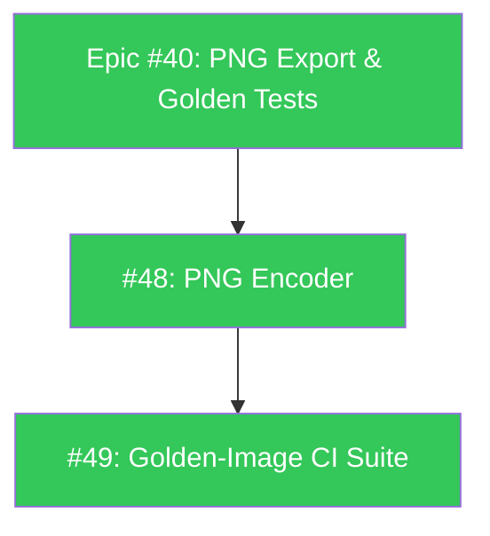
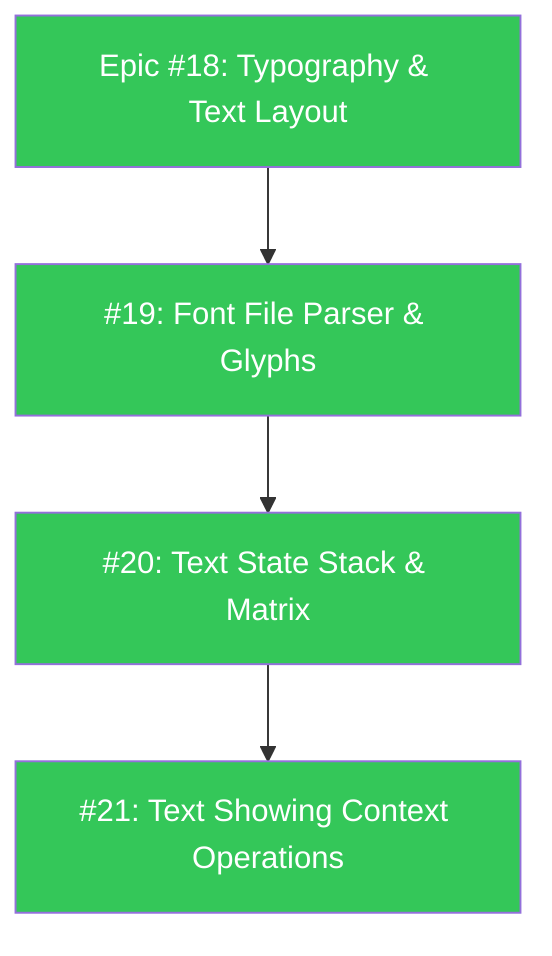
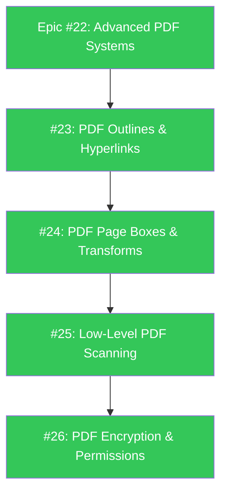

# PureDraw

<p align="center">
  
</p>

<p align="center"><em>Everything above is rendered entirely by PureDraw to a vector PDF: a bezier-path character with a squircle head, gradients, blending, translucent shadows, the crumple deformer, a 3D cube with a projective grid texture, and an Apple-color scarf.</em></p>

[](https://github.com/mihaelamj/PureDraw/actions/workflows/style.yml)
[](https://github.com/mihaelamj/PureDraw/actions/workflows/swift-macos.yml)
[](https://github.com/mihaelamj/PureDraw/actions/workflows/swift-linux.yml)
[](https://github.com/mihaelamj/PureDraw/actions/workflows/swift-windows.yml)
[](https://github.com/mihaelamj/PureDraw/actions/workflows/swift-wasm.yml)
[](LICENSE)


PureDraw is a dependency-free, Swift-native 2D vector graphics engine.

It provides a "Virtual PostScript Machine" API compatible with CoreGraphics (Quartz) and the HTML5 Canvas. The library is highly portable and follows a strict design:
- **Zero external dependencies** (no SPM dependencies, no package drift)
- **Zero bundled C/C++ sources** (pure Swift)
- **No Foundation requirements** in the core library target
- **Cross-platform build gates** for macOS, Linux, Windows, and WebAssembly (WASI)

---

## Preview

The capability showcase at the top of this page is generated by `generateShowcasePDF` in the test suite. Here is an earlier 3D perspective scene, also rendered entirely by PureDraw, showing linear gradients, 3D grids, perspective-distorted badges, crumpled paper deformation, multiply blend modes, and drop shadows:


---

## Core Features

### 1. Advanced Transformations
* **Affine Transforms:** Full 3x3 matrix math (`AffineTransform`) for scaling, rotation, translation, and skewing.
* **Projective Transforms:** Homography/quadrilateral mapping (`ProjectiveTransform.rectToQuad`) to map 2D coordinates into arbitrary 3D perspective quads.

### 2. Path Deformations
* **Path Subdivision:** Fine-grained subdivision (`path.subdivided(maxSegmentLength:)`) to break straight lines and curves into high-resolution micro-segments.
* **Non-Linear Deformers:** Dynamic vertex displacement (e.g. `CrumpleDeformer`) to simulate physical processes like paper crushing, pinching, and wrinkling.

### 3. State-Based Graphics Context
* Standard vector drawing API with `move(to:)`, `addLine(to:)`, `addCurve(to:)`, `addEllipse(in:)`, and `addRoundedRect(in:)`.
* Graphics state stack via `saveGState()` and `restoreGState()`.
* Native support for **clipping paths**, **linear gradients**, and **vector drop shadows**.
* Compositing and transparency controls, including **blend modes** (like `multiply`).

### 4. Vector Export Engines
* **PDFRenderer:** Compiles graphics contexts to compact, standard PDF documents.
* **SVGRenderer:** Exports to scalable vector graphics XML.
* **PostScriptRenderer:** Exports standard EPS (Encapsulated PostScript) vector code.
* **CoreGraphicsRenderer:** Bridges directly to Apple's native CoreGraphics framework.

### 5. Declarative Validation Framework
* Follows the **OpenAPIKit validation idiom** by Matt Polzin.
* Validation rules are composable values (`Validation<Subject>`), not imperative `if-else` trees.
* Validates geometry finiteness, clipping boundaries, color parameters, and graphic state nesting.

---

## Code Example

```swift
import PureDraw

// 1. Create a Graphics Context
var context = GraphicsContext()

// 2. Configure Graphic State
context.saveGState()
context.setFillColor(Color(red: 0.1, green: 0.7, blue: 0.9, alpha: 0.8))
context.setShadow(offset: Point(x: 4, y: 4), blur: 5.0, color: Color(red: 0, green: 0, blue: 0, alpha: 0.4))

// 3. Define a Homography (Projective) Transform
let sourceRect = Rect(x: 0, y: 0, width: 100, height: 100)
let targetQuad = (
    p0: Point(x: 20, y: 10),  // Top-left
    p1: Point(x: 120, y: 5),  // Top-right
    p2: Point(x: 110, y: 95), // Bottom-right
    p3: Point(x: 10, y: 80)   // Bottom-left
)
let transform = ProjectiveTransform.rectToQuad(
    sourceRect,
    p0: targetQuad.p0,
    p1: targetQuad.p1,
    p2: targetQuad.p2,
    p3: targetQuad.p3
)

// 4. Construct and Transform Geometry
var path = Path()
path.addRoundedRect(in: sourceRect, cornerWidth: 8, cornerHeight: 8)
let transformedPath = path.applying(transform)

context.addPath(transformedPath)
context.fillPath()
context.restoreGState()

// 5. Render to Vector PDF
let pdfData = try PDFRenderer(width: 200, height: 200).render(context)
```

---

## Build and Test

PureDraw uses standard SwiftPM commands:

```bash
# Build the library and test targets
swift build

# Run the test suite (generates test outputs)
swift test

# Run code formatter
swiftformat . --config .swiftformat

# Run code linter
swiftlint --config .swiftlint.yml --strict
```

Alternatively, you can run all local verification gates with:
```bash
bash scripts/check-all.sh
```

To measure rasterizer throughput (deterministic scenes, no CI timing assertions):
```bash
swift run -c release puredraw-bench
```

---

## Roadmap

### Status Diagram

```mermaid
flowchart TB
    classDef done    fill:#34C759,color:#FFFFFF
    classDef active  fill:#007AFF,color:#FFFFFF
    classDef review  fill:#30B0C7,color:#FFFFFF
    classDef next    fill:#5856D6,color:#FFFFFF
    classDef partial fill:#FF9500,color:#FFFFFF
    classDef todo    fill:#8E8E93,color:#FFFFFF

    E0["E0 (#1): Math Primitives"]:::done --> E1["E1 (#2): Path Construction"]:::done --> E2["E2 (#3): Graphic State"]:::done --> E3["E3 (#4): Rendering Bridge"]:::done --> TL["Transparency Layers"]:::done --> CS["CMYK & Gray Color Spaces"]:::done --> P1_1["#27: GState Settings"]:::done --> P1_2["#28: Path Hit-Testing"]:::done --> Epic9["Epic #9: Bitmap Images & Rasterization"]:::done --> Epic39["Epic #39: Image Model Hardening"]:::done --> Epic38["Epic #38: Rasterizer Quality"]:::done --> Epic13["Epic #13: Masking, Caching & Streams"]:::done --> Epic40["Epic #40: PNG Export & Golden Tests"]:::done --> Epic18["Epic #18: Typography & Text Layout"]:::done --> Epic22["Epic #22: Advanced PDF Systems"]:::done --> Epic53["Epic #53: Validation Completeness"]:::done --> Epic58["Epic #58: Performance"]:::done --> Epic59["Epic #59: API Documentation"]:::next --> Epic60["Epic #60: CFF Outlines"]:::done --> Epic61["Epic #61: Selectable Native Text"]:::done --> Epic74["Epic #74: Extended Font Formats"]:::todo

    click E0 href "https://github.com/mihaelamj/PureDraw/issues/1" "E0"
    click E1 href "https://github.com/mihaelamj/PureDraw/issues/2" "E1"
    click E2 href "https://github.com/mihaelamj/PureDraw/issues/3" "E2"
    click E3 href "https://github.com/mihaelamj/PureDraw/issues/4" "E3"
    click P1_1 href "https://github.com/mihaelamj/PureDraw/issues/27" "Issue #27"
    click P1_2 href "https://github.com/mihaelamj/PureDraw/issues/28" "Issue #28"
    click Epic9 href "https://github.com/mihaelamj/PureDraw/issues/9" "Epic #9"
    click Epic39 href "https://github.com/mihaelamj/PureDraw/issues/39" "Epic #39"
    click Epic38 href "https://github.com/mihaelamj/PureDraw/issues/38" "Epic #38"
    click Epic13 href "https://github.com/mihaelamj/PureDraw/issues/13" "Epic #13"
    click Epic40 href "https://github.com/mihaelamj/PureDraw/issues/40" "Epic #40"
    click Epic18 href "https://github.com/mihaelamj/PureDraw/issues/18" "Epic #18"
    click Epic22 href "https://github.com/mihaelamj/PureDraw/issues/22" "Epic #22"
    click Epic53 href "https://github.com/mihaelamj/PureDraw/issues/53" "Epic #53"
    click Epic58 href "https://github.com/mihaelamj/PureDraw/issues/58" "Epic #58"
    click Epic59 href "https://github.com/mihaelamj/PureDraw/issues/59" "Epic #59"
    click Epic60 href "https://github.com/mihaelamj/PureDraw/issues/60" "Epic #60"
    click Epic61 href "https://github.com/mihaelamj/PureDraw/issues/61" "Epic #61"
    click Epic74 href "https://github.com/mihaelamj/PureDraw/issues/74" "Epic #74"
```


### Status Legend


### Epic #9: Bitmap Images & Rasterization Support


### Epic #39: Image Model Hardening


### Epic #38: Rasterizer Quality & Correctness


### Epic #13: Image Masking, Caching & Data Streams


### Epic #40: PNG Export & Golden-Image Tests


### Epic #18: Typography and Text Layout Engine


### Epic #22: Advanced PDF Systems


---

## Community & Documentation

* [CONTRIBUTING.md](CONTRIBUTING.md) : How to contribute and code conventions.
* [SECURITY.md](SECURITY.md) : Vulnerability reporting policy.
* [SUPPORT.md](SUPPORT.md) : How to get help or ask questions.
* [CODE_OF_CONDUCT.md](CODE_OF_CONDUCT.md) : Community guidelines.
* [AGENTS.md](AGENTS.md) : AI agent instructions.
* [LICENSE](LICENSE) : Licensed under the MIT License.
