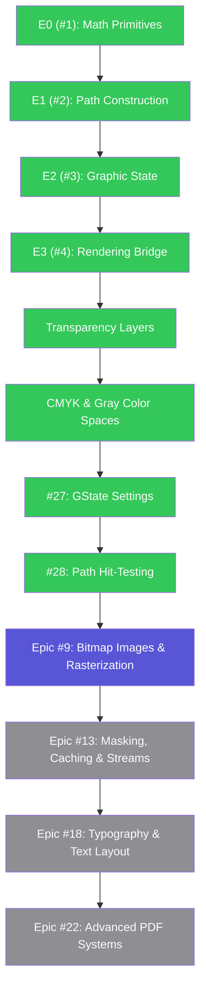
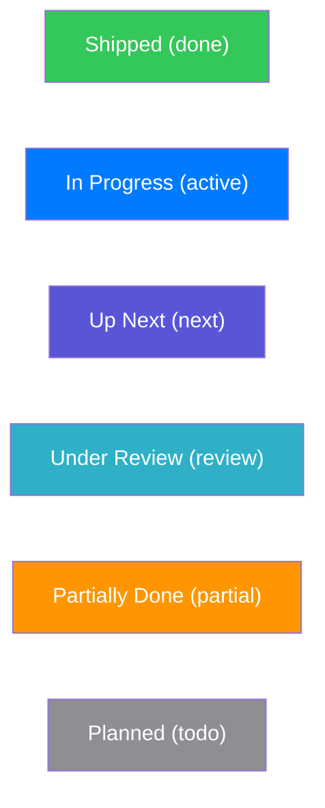

# Prioritized Roadmap: Quartz 2D & CoreGraphics Gaps

This roadmap outlines the recommended prioritization for implementing the missing features in `PureDraw`. The ordering is determined by **value-to-complexity ratio**, **architectural dependencies**, and maintaining `PureDraw`'s design constraints (e.g. dependency-free, Foundation-free core).

---

## 1. Dependency Graph & Phase Overview

### Status Diagram

### Status Legend

---

## 2. Detailed Phases

### Phase 1: Core Context & Geometry Extensions (Low Complexity / High Value)
These additions expand existing data structures in `PureDraw` with zero external dependencies and low complexity.

#### 1. GState Settings (Issue 1)
*   **Why**: Required to toggle anti-aliasing, set image interpolation algorithms, and adjust rendering intents during color matching.
*   **Complexity**: Low. Adds `shouldAntialias`, `interpolationQuality`, and `renderingIntent` properties into [GraphicState.swift](file:///Volumes/Code/DeveloperExt/public/PureDraw/Sources/Core/GraphicState.swift).

#### 2. Path Hit-Testing (Issue 2)
*   **Why**: Crucial for interactive canvas apps to detect clicks/taps on vector shapes.
*   **Complexity**: Medium. Requires a containment algorithm (`contains(point:rule:)`) checking if a point falls within a path boundary.

---

### Phase 2: Images, Masking & Streams (Medium Complexity / High Value)
This phase introduces raster image representation, offscreen rendering, and data streaming.

#### 1. Bitmap Images & Context (Issue 3)
*   **Why**: Essential for rendering bitmap files and generating image snapshots in-memory.
*   **Complexity**: Medium-High. Requires an image model and a CPU-based rasterizer engine.

#### 2. Stencil & Chroma Masking (Issue 4)
*   **Why**: Allows image alpha clipping and chroma key color filtering.
*   **Complexity**: Medium. Depends on the raw `Image` structure from Phase 2.1.

#### 3. Caching Layers (`CGLayer`) (Issue 5)
*   **Why**: Optimizes repeated stamp/brush-style vector drawings by caching them as pre-rendered textures.
*   **Complexity**: Medium. Gated on the bitmap context architecture.

#### 4. Image I/O Metadata (Issue 6)
*   **Why**: Reading and writing EXIF/GPS metadata blocks.
*   **Complexity**: Medium.

#### 5. Data Streams (`CGDataProvider`) (Issue 7)
*   **Why**: Decoupled file/memory stream handlers (`CGDataProvider`/`CGDataConsumer`).
*   **Complexity**: Low-Medium.

---

### Phase 3: Fills & Patterns (High Complexity / Medium Value)
These features implement advanced tiling and gradient shaders.

#### 1. Colored & Template Patterns (Issue 8)
*   **Why**: Allows repeating vector textures (cross-hatching, grids).
*   **Complexity**: High. Requires a pattern coordinate space and tiling matrix math.

#### 2. Custom Shading Functions (Issue 9)
*   **Why**: Procedural lighting and math-function gradients.
*   **Complexity**: High. Requires evaluating algebraic coordinate functions per coordinate during rendering.

---

### Phase 4: Typography and Text Layout (Very High Complexity / High Value)
Building a typography engine without third-party C libraries (like FreeType) is exceptionally complex. 

#### 1. Font Engine & Layout (Issue 10)
*   **Implementation Strategy**:
    - *Phase A (Bridge)*: Forward commands directly to Apple's CoreText when running on macOS/iOS.
    - *Phase B (SVG Fonts)*: Translate text strings into vector [Path](file:///Volumes/Code/DeveloperExt/public/PureDraw/Sources/Core/Path.swift) shapes using simple JSON/SVG vector fonts on Linux/Windows.
    - *Phase C (Native OTF)*: Build a pure-Swift OpenType font file parser to decode tables (`cmap`, `glyf`) natively.

---

### Phase 5: Advanced PDF Systems (High Complexity / Medium Value)
This phase completes the PDF engine with interactive navigation, scanning, and decryption.

#### 1. PDF Outlines & Links (Issue 11)
*   **Why**: Hyperlinks, outline navigation lists, and coordinates-based hotspot annotations.
*   **Complexity**: Medium.

#### 2. PDF Page Boxes & Drawing Transforms (Issue 12)
*   **Why**: Page margins (`CropBox`, `BleedBox`) and auto-fitting CTM calculations.
*   **Complexity**: Medium.

#### 3. PDF Content Scanning (Issue 13)
*   **Why**: Decomposing existing PDFs by tokenizing streams and invoking callback tables on PDF operators (`Do`, `EI`).
*   **Complexity**: High.

#### 4. PDF Document Encryption (Issue 14)
*   **Why**: Password-based decryption (`CGPDFDocumentUnlockWithPassword`) and permissions validation.
*   **Complexity**: Medium-High.
