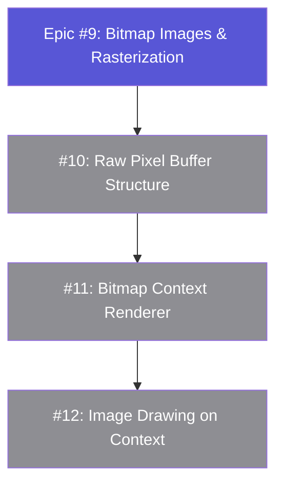
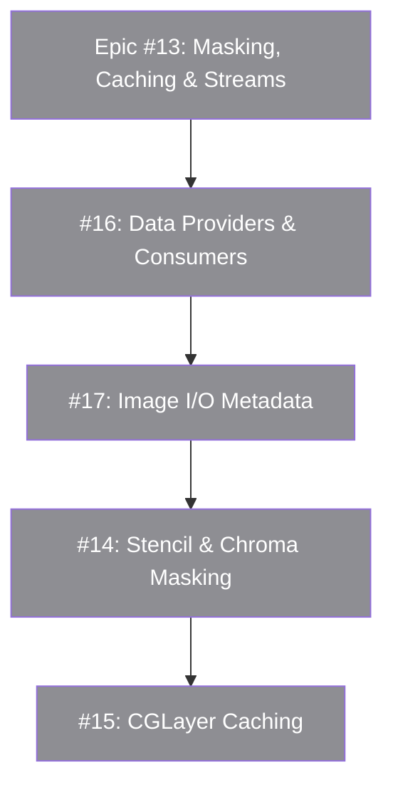
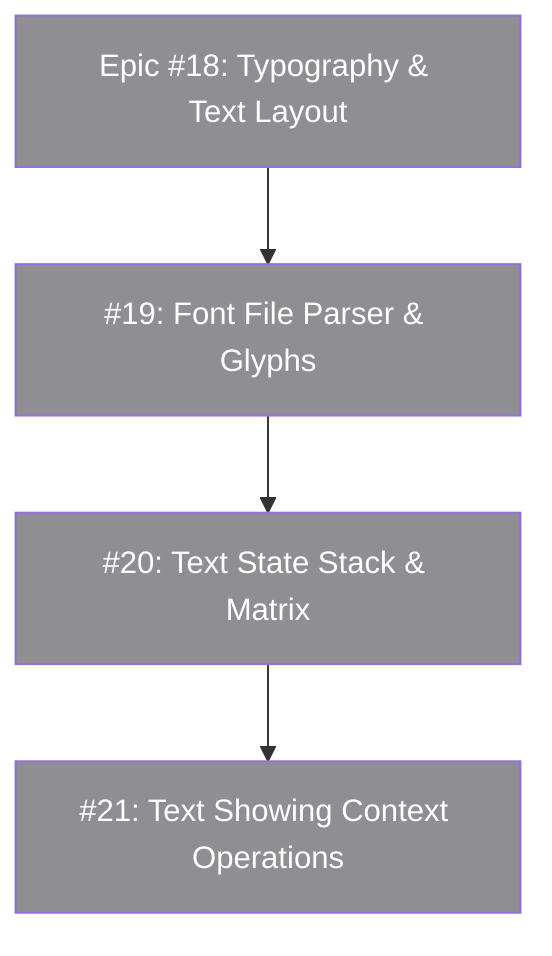
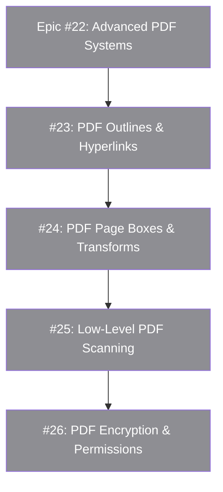

# GitHub Issue Templates for CoreGraphics/Quartz 2D Gaps

This document defines ready-to-file GitHub issues to address all missing features and architectural gaps in `PureDraw`, structured by parent Epics and child Issues.

---

## 1. Epic: Bitmap Images and Rasterization Support
**Epic Title:** `epic: implement bitmap images and offscreen rasterization`  
**Labels:** `epic`, `enhancement`

### Description
Introduce a native structure representing raw raster pixel data (RGBA) and a bitmap graphics context to render paths onto pixel memory buffers.

### Child Issues

#### Issue 1a: `feat: implement raw pixel image buffer structure (CGImage equivalent)`
* **Description**: Create a raw pixel buffer structure that holds layout configuration (e.g., RGBA8888, Grayscale, premultiplied alpha channels, or float components).
* **Affected Files**: `Sources/Core/Image.swift` (New file)

#### Issue 1b: `feat: implement bitmap context graphics renderer (CGBitmapContext equivalent)`
* **Description**: Implement a graphics context renderer that rasterizes path drawing commands, strokes, fills, and transparencies into a raw pixel memory buffer instead of vector instructions.
* **Affected Files**: `Sources/Renderers/BitmapRenderer.swift` (New file)

#### Issue 1c: `feat: implement drawing images on context`
* **Description**: Extend `GraphicsContext` to support a drawing operation that scales and rotates an input image within a target rect frame: `context.draw(_ image: Image, in rect: Rect)`.
* **Affected Files**: 
  - [Sources/Core/GraphicsContext.swift](file:///Volumes/Code/DeveloperExt/public/PureDraw/Sources/Core/GraphicsContext.swift)
  - [Sources/Core/DrawOperation.swift](file:///Volumes/Code/DeveloperExt/public/PureDraw/Sources/Core/DrawOperation.swift)

---

## 2. Epic: Image Masking, Caching & Data Streams
**Epic Title:** `epic: implement image masking, cache layers, and data streams`  
**Labels:** `epic`, `enhancement`

### Description
Support image-based clipping masks, hardware-optimized cached drawing layers, and generic data streams for file/memory access.

### Child Issues

#### Issue 2a: `feat: implement stencil, alpha, and chroma-key image masking`
* **Description**: Support masking/clipping operations where drawing is filtered based on the alpha or luminance channels of a masking image, and chroma key color-range filtering.
* **Affected Files**:
  - [Sources/Core/GraphicState.swift](file:///Volumes/Code/DeveloperExt/public/PureDraw/Sources/Core/GraphicState.swift)
  - [Sources/Core/GraphicsContext.swift](file:///Volumes/Code/DeveloperExt/public/PureDraw/Sources/Core/GraphicsContext.swift)

#### Issue 2b: `feat: implement hardware-optimized drawing cache layers (CGLayer)`
* **Description**: Introduce cached drawing layers (`CGLayer` equivalent) initialized from a destination context, designed for low-overhead repeated stamp/brush drawing.
* **Affected Files**: [Sources/Core/GraphicsContext.swift](file:///Volumes/Code/DeveloperExt/public/PureDraw/Sources/Core/GraphicsContext.swift)

#### Issue 2c: `feat: implement data providers and data consumers (CGDataProvider)`
* **Description**: Abstract memory and file access streams (`CGDataProvider`/`CGDataConsumer` equivalents) to decouple serialization from graphics targets.
* **Affected Files**: `Sources/Core/DataProvider.swift` (New file)

#### Issue 2d: `feat: implement image I/O container metadata parsing`
* **Description**: Extract EXIF, GPS, and IPTC metadata streams from image file structures.
* **Affected Files**: `Sources/Core/ImageMetadata.swift` (New file)

---

## 3. Epic: Typography and Text Layout Engine
**Epic Title:** `epic: implement native font registration and text rendering`  
**Labels:** `epic`, `enhancement`

### Description
Support loading font files (TTF/OTF), managing text transformations, measuring layout bounds, and showing text glyphs.

### Child Issues

#### Issue 3a: `feat: implement font file parser and glyph registration`
* **Description**: Create a TTF/OTF font file parser to decode tables (`cmap`, `glyf`) to convert characters to vector paths.
* **Affected Files**: `Sources/Core/Font.swift` (New file)

#### Issue 3b: `feat: implement text state stack properties and matrix`
* **Description**: Extend graphics state to hold text CTM matrix (`CGContextSetTextMatrix`), font size, character spacing, and text rendering modes.
* **Affected Files**:
  - [Sources/Core/GraphicState.swift](file:///Volumes/Code/DeveloperExt/public/PureDraw/Sources/Core/GraphicState.swift)
  - [Sources/Core/GraphicsContext.swift](file:///Volumes/Code/DeveloperExt/public/PureDraw/Sources/Core/GraphicsContext.swift)

#### Issue 3c: `feat: implement text showing context operations`
* **Description**: Add text drawing functions `showText(_:at:)` and `showGlyphs(_:at:)` to `GraphicsContext` and map them in renderers.
* **Affected Files**: [Sources/Core/GraphicsContext.swift](file:///Volumes/Code/DeveloperExt/public/PureDraw/Sources/Core/GraphicsContext.swift)

---

## 4. Epic: Advanced PDF Systems
**Epic Title:** `epic: implement PDF outlines, scanning, and security model`  
**Labels:** `epic`, `enhancement`

### Description
Extend the PDF engine with outlines, page bounds, content scanning/parsing, and security decryption.

### Child Issues

#### Issue 4a: `feat: implement PDF outline trees, hyperlinks, and annotations`
* **Description**: Support hierarchical document outline tables of contents, destinations, and hot-spot URL annotations.
* **Affected Files**: [Sources/Renderers/PDFRenderer.swift](file:///Volumes/Code/DeveloperExt/public/PureDraw/Sources/Renderers/PDFRenderer.swift)

#### Issue 4b: `feat: support PDF boundary boxes (CropBox, BleedBox) and fit transforms`
* **Description**: Support CropBox, BleedBox, TrimBox, and ArtBox, and implement a transform calculator equivalent to `CGPDFPageGetDrawingTransform`.
* **Affected Files**: [Sources/Renderers/PDFRenderer.swift](file:///Volumes/Code/DeveloperExt/public/PureDraw/Sources/Renderers/PDFRenderer.swift)

#### Issue 4c: `feat: implement low-level PDF scanning and operator parsing`
* **Description**: Build a content stream scanner (`CGPDFScanner` equivalent) to read and parse vector paths from existing PDF documents.
* **Affected Files**: `Sources/Renderers/PDFScanner.swift` (New file)

#### Issue 4d: `feat: implement PDF document encryption and user permissions`
* **Description**: Support password-based decryption (`CGPDFDocumentUnlockWithPassword`) and printing/copying permissions validation.
* **Affected Files**: [Sources/Renderers/PDFRenderer.swift](file:///Volumes/Code/DeveloperExt/public/PureDraw/Sources/Renderers/PDFRenderer.swift)

---

## 5. Miscellaneous Context & Pattern Features

### Issue 5: `feat: implement graphics state parameters (antialiasing, interpolation, rendering intent)`
* **Labels**: `enhancement`, `good first issue`
* **Description**: Add `shouldAntialias`, `interpolationQuality`, and `renderingIntent` properties and context setters.
* **Affected Files**:
  - [Sources/Core/GraphicState.swift](file:///Volumes/Code/DeveloperExt/public/PureDraw/Sources/Core/GraphicState.swift)
  - [Sources/Core/GraphicsContext.swift](file:///Volumes/Code/DeveloperExt/public/PureDraw/Sources/Core/GraphicsContext.swift)

### Issue 6: `feat: implement path hit-testing and point containment`
* **Labels**: `enhancement`
* **Description**: Add ray-casting winding number check on `Path`: `func contains(_ point: Point, using rule: FillRule) -> Bool`.
* **Affected Files**: [Sources/Core/Path.swift](file:///Volumes/Code/DeveloperExt/public/PureDraw/Sources/Core/Path.swift)

### Issue 7: `feat: implement colored and uncolored repeating pattern fills`
* **Labels**: `enhancement`
* **Description**: Support colored and uncolored cell textures tiling.
* **Affected Files**:
  - [Sources/Core/GraphicState.swift](file:///Volumes/Code/DeveloperExt/public/PureDraw/Sources/Core/GraphicState.swift)
  - [Sources/Core/GraphicsContext.swift](file:///Volumes/Code/DeveloperExt/public/PureDraw/Sources/Core/GraphicsContext.swift)

### Issue 8: `feat: support custom CGFunction mathematical gradients`
* **Labels**: `enhancement`
* **Description**: Support procedural math functional shadings evaluated per coordinate.
* **Affected Files**: [Sources/Core/Gradient.swift](file:///Volumes/Code/DeveloperExt/public/PureDraw/Sources/Core/Gradient.swift)
